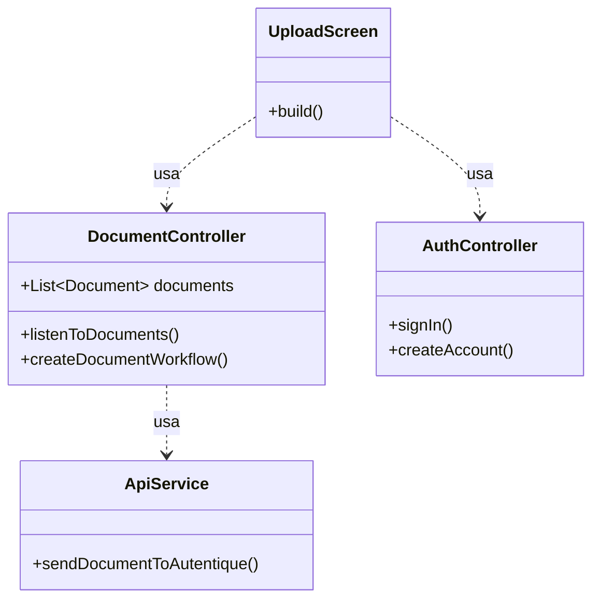

# FlowSign - Workflow de Assinatura Digital de Documentos

## Índice

- [Objetivo](#objetivo)
- [Arquitetura do Sistema](#arquitetura-do-sistema)
- [Diagramas](#diagramas)
- [Requisitos de Software](#requisitos-de-software)
- [Stacks Utilizadas](#stacks-utilizadas)
- [Instruções de Uso](#instruções-de-uso)

---

## Objetivo

O projeto consiste no desenvolvimento de um aplicativo móvel de workflow de documentos para assinatura digital. Nele, cada usuário cadastrado (proprietário do documento) pode fazer upload de arquivos nos formatos PDF ou DOCX, definir uma lista sequencial de signatários (com nome, CPF/CNPJ e e-mail) e iniciar um fluxo onde o sistema encaminha automaticamente o documento, por ordem, a cada pessoa para assinatura. A cada etapa, o signatário recebe um e-mail com o link de assinatura, assina eletronicamente e, então, o documento avança para o próximo; quando todos assinarem, o PDF final é armazenado e pode ser baixado pelo proprietário. Além disso, o app mantém um histórico dos “Últimos Documentos” enviados, exibindo estado (Em andamento, Concluído ou Cancelado) e detalhes de cada signatário (pendente, assinado ou ignorado). Usuários não autenticados são direcionados à tela de login, garantindo que apenas o dono acesse seus documentos e seu fluxo de assinaturas.

---

## Arquitetura do Sistema

O sistema foi desenvolvido com uma arquitetura moderna e desacoplada, separando as responsabilidades entre o cliente (aplicativo móvel) e o servidor (backend na nuvem).

### **Frontend (Flutter)**

O aplicativo móvel foi construído em Flutter, utilizando o gerenciador de estado **GetX** para controlar o estado da interface, a navegação e a injeção de dependências. A estrutura do código separa a lógica de negócio (Controllers) dos componentes visuais (Views) e dos serviços de acesso a dados (Services).

### **Backend (Firebase Cloud Functions)**

O backend é serverless, implementado com **Node.js** e **Firebase Cloud Functions**. Ele tem duas responsabilidades principais:
1.  **API Segura:** Servir como um ponto de entrada para a lógica de negócio principal.
2.  **Processamento de Webhooks:** Receber notificações em tempo real de um serviço externo (Autentique) para atualizar o status dos documentos no banco de dados. A comunicação é protegida por um segredo de webhook (HMAC) para garantir que apenas notificações autênticas sejam processadas.

### **Banco de Dados (Cloud Firestore)**

Utilizamos o **Cloud Firestore**, um banco de dados NoSQL, flexível e escalável do Firebase. Ele armazena os dados de usuários e documentos. O aplicativo Flutter se conecta a ele em tempo real (usando Streams), garantindo que qualquer atualização feita pelo backend seja refletida instantaneamente na interface do usuário sem a necessidade de recarregar a tela.

### **Serviços Externos**
- **Firebase Authentication:** Para gerenciamento completo e seguro de login e criação de contas.
- **Autentique API:** Serviço de terceiros utilizado para gerenciar o envio de documentos e o processo de coleta de assinaturas digitais.

---

## Diagramas

### Diagrama de Caso de Uso

Representa as interações dos atores (usuários e sistemas) com as funcionalidades principais do FlowSign.

```mermaid
use-case "Diagrama de Caso de Uso - FlowSign" {
    actor "Usuário Proprietário" as User
    actor "Signatário" as Signer
    
    package "Sistema FlowSign (App + Backend)" {
        User - -> (Gerenciar Conta)
        (Gerenciar Conta) ..> (Criar Conta) : <<extend>>
        (Gerenciar Conta) ..> (Fazer Login) : <<extend>>
        (Gerenciar Conta) ..> (Fazer Logout) : <<extend>>

        User - -> (Iniciar Fluxo de Assinatura)
        (Iniciar Fluxo de Assinatura) ..> (Selecionar Arquivo) : <<include>>
        (Iniciar Fluxo de Assinatura) ..> (Adicionar Signatários) : <<include>>

        User - -> (Acompanhar Documentos)
        (Acompanhar Documentos) ..> (Verificar Status do Documento) : <<extend>>
        (Acompanhar Documentos) ..> (Verificar Status dos Signatários) : <<extend>>

    }

    package "Plataforma Externa" {
        actor "Sistema Autentique" as Autentique
    }

    (Iniciar Fluxo de Assinatura) - -> Autentique : envia dados
    
    Signer -> (Receber E-mail para Assinatura)
    (Receber E-mail para Assinatura) - - Autentique

    Signer -> (Assinar ou Rejeitar Documento)
    (Assinar ou Rejeitar Documento) - - Autentique
    
    Autentique -> (Notificar Sistema via Webhook)
    (Notificar Sistema via Webhook) - -> (Acompanhar Documentos)
}
```

### Diagrama de Classes Simplificado

Mostra as principais classes do aplicativo Flutter e seus relacionamentos.



---

## Requisitos de Software

### Requisitos Funcionais:

**RF01** Autenticação de usuários (login, logout, criar conta).
**RF02** Upload de documentos nos formatos PDF e DOCX.
**RF03** Cadastro de múltiplos signatários com nome, CPF, e-mail e definição de ordem de assinatura.
**RF04** Início do fluxo de assinatura via integração com a API do Autentique.
**RF05** Envio automático de e-mail pela plataforma externa ao signatário ativo com link para assinatura.
**RF06** Recebimento de webhook para confirmação de assinatura (`signature.accepted`) e rejeição (`signature.rejected`).
**RF07** Exibição do status de cada signatário (pendente, assinado, rejeitado) em tempo real no aplicativo.
**RF08** Exibição do status geral do documento (em_andamento, concluido, cancelado).
**RF09** Histórico de documentos enviados para cada usuário.
**RF10** Proteção de dados garantindo que um usuário só pode ver seus próprios documentos.

### Requisitos Não Funcionais:

**RNF01** O aplicativo deve ser compatível com as versões mais recentes de Android e iOS.
**RNF02** A comunicação com as APIs (Autentique e Firebase) deve ser segura (HTTPS).
**RNF03** Chaves de API e segredos do backend devem ser gerenciados como variáveis de ambiente e não expostos no código-fonte.
**RNF04** O backend deve ser serverless e escalável (Cloud Functions).
**RNF05** O banco de dados deve ser seguro contra acesso não autorizado (Firestore Security Rules).
**RNF06** A interface deve ser responsiva e fornecer feedback visual para o usuário durante operações de longa duração (carregamento).

---

## Stacks Utilizadas

- **Frontend (Mobile):** Flutter/Dart
- **Gerenciamento de Estado (Flutter):** GetX
- **Backend (Serverless):** Node.js + Firebase Cloud Functions
- **Banco de Dados:** Cloud Firestore
- **Autenticação:** Firebase Authentication
- **Serviço de Assinaturas:** API do Autentique

---

## Instruções de Uso

### Backend (Cloud Functions)

1. Certifique-se de ter o **Node.js** e as **Ferramentas de Linha de Comando do Firebase** (`firebase-tools`) instalados.
2. Crie um projeto no Firebase e configure o Firestore e Authentication.
3. Clone o repositório do backend.
4. Na pasta `functions`, crie um arquivo `.env.<SEU_PROJECT_ID>` e adicione o `AUTENTIQUE_SECRET`.
5. Execute `npm install` dentro da pasta `functions`.
6. Execute `firebase deploy --only functions` para publicar o backend.
7. Configure a URL gerada e o segredo no painel de webhooks do Autentique.

### Mobile (Flutter)

1. Certifique-se de ter o **Flutter** instalado na sua máquina.
2. Clone o repositório do frontend.
3. Configure o seu projeto Flutter para se conectar ao seu projeto Firebase (usando o `flutterfire configure`).
4. Crie um arquivo `.env` na raiz do projeto Flutter e adicione a chave da API do Autentique.
5. Execute `flutter pub get` para instalar as dependências.
6. Execute `flutter run` para iniciar o aplicativo em um emulador ou dispositivo físico.
```