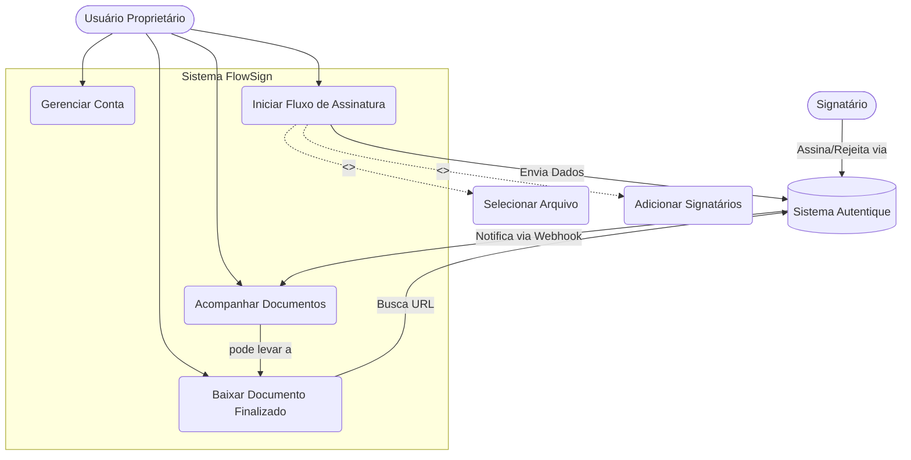

# FlowSign - Workflow de Assinatura Digital de Documentos

## Índice

- [Objetivo](#objetivo)
- [Arquitetura do Sistema](#arquitetura-do-sistema)
- [Diagramas](#diagramas)
- [Requisitos de Software](#requisitos-de-software)
- [Stacks Utilizadas](#stacks-utilizadas)
- [Instruções de Uso](#instruções-de-uso)

---

## Objetivo

Este projeto consiste no desenvolvimento de uma solução full-stack para um workflow de assinatura digital de documentos, composta por um aplicativo móvel em Flutter e um backend serverless no Firebase. O sistema gerencia todo o ciclo de vida de um documento, desde o seu envio até a coleta de assinaturas, com atualizações de status em tempo real para o usuário.

As funcionalidades principais incluem:

Criação de Fluxo de Assinatura: Permite que usuários autenticados façam o upload de documentos (PDF, DOCX) e definam uma lista sequencial de signatários, cada um com seu nome, CPF e e-mail.

Automação do Processo: Uma vez iniciado, o sistema, através da integração com uma API externa (Autentique), notifica automaticamente cada signatário por e-mail, seguindo a ordem pré-definida. O link de assinatura é único para cada etapa do processo.

Acompanhamento em Tempo Real: O aplicativo exibe um dashboard onde o proprietário pode acompanhar o status geral de seus documentos (Em andamento, Concluído, Cancelado) e o progresso detalhado de cada signatário (Pendente, Assinado). A interface é atualizada automaticamente através de webhooks e streams de dados do Firestore, sem a necessidade de recarregar a tela.

Download Seguro: Após a conclusão do fluxo de assinaturas, o proprietário do documento pode baixar a versão final e assinada diretamente do aplicativo, garantindo acesso rápido e seguro ao arquivo finalizado.

Segurança e Controle de Acesso: A plataforma garante a segurança e a privacidade dos dados através da autenticação de usuários (Firebase Authentication) e de regras de acesso no banco de dados que permitem que um usuário acesse e gerencie apenas os seus próprios documentos (Firestore Security Rules).

O objetivo final é fornecer uma ferramenta robusta, segura e intuitiva para a gestão de assinaturas digitais, demonstrando a integração de tecnologias de frontend, backend e serviços de terceiros em uma arquitetura reativa e moderna.

---

## Arquitetura do Sistema

O sistema foi desenvolvido com uma arquitetura moderna e desacoplada, separando as responsabilidades entre o cliente (aplicativo móvel) e o servidor (backend na nuvem).

### **Frontend (Flutter)**

O aplicativo móvel foi construído em Flutter, utilizando o gerenciador de estado **GetX** para controlar o estado da interface, a navegação e a injeção de dependências. A estrutura do código separa a lógica de negócio (Controllers) dos componentes visuais (Views) e dos serviços de acesso a dados (Services).

### **Backend (Firebase Cloud Functions)**

O backend é serverless, implementado com **Node.js** e **Firebase Cloud Functions**. Ele tem duas responsabilidades principais:
1.  **API Segura:** Servir como um ponto de entrada para a lógica de negócio principal.
2.  **Processamento de Webhooks:** Receber notificações em tempo real de um serviço externo (Autentique) para atualizar o status dos documentos no banco de dados. A comunicação é protegida por um segredo de webhook (HMAC) para garantir que apenas notificações autênticas sejam processadas.

### **Banco de Dados (Cloud Firestore)**

Foi utilizado o **Cloud Firestore**, um banco de dados NoSQL, flexível e escalável do Firebase. Ele armazena os dados de usuários e documentos. O aplicativo Flutter se conecta a ele em tempo real (usando Streams), garantindo que qualquer atualização feita pelo backend seja refletida instantaneamente na interface do usuário sem a necessidade de recarregar a tela.

### **Serviços Externos**
- **Firebase Authentication:** Para gerenciamento completo e seguro de login e criação de contas.
- **Autentique API:** Serviço de terceiros utilizado para gerenciar o envio de documentos e o processo de coleta de assinaturas digitais.

---

## Diagramas

### Diagrama de Caso de Uso

Representa as interações dos atores (usuários e sistemas) com as funcionalidades principais do FlowSign.

### Diagrama de Classes Simplificado

Mostra as principais classes do aplicativo Flutter e seus relacionamentos.

---

## Requisitos de Software

### Requisitos Funcionais:

- **RF01** Autenticação de usuários (login, logout, criar conta).
- **RF02** Upload de documentos nos formatos PDF e DOCX.
- **RF03** Cadastro de múltiplos signatários com nome, CPF, e-mail e definição de ordem de assinatura.
- **RF04** Início do fluxo de assinatura via integração com a API do Autentique.
- **RF05** Envio automático de e-mail pela plataforma externa ao signatário ativo com link para assinatura.
- **RF06** Recebimento de webhook para confirmação de assinatura (`signature.accepted`) e rejeição (`signature.rejected`).
- **RF07** Exibição do status de cada signatário (pendente, assinado, rejeitado) em tempo real no aplicativo.
- **RF08** Exibição do status geral do documento (em_andamento, concluido, cancelado).
- **RF09** Histórico de documentos enviados para cada usuário.
- **RF10** Proteção de dados garantindo que um usuário só pode ver seus próprios documentos.
- **RF11** O sistema deve permitir que o proprietário do documento realize o download do arquivo final após todos os signatários terem assinado.

### Requisitos Não Funcionais:

- **RNF01** O aplicativo deve ser compatível com as versões mais recentes de Android e iOS.
- **RNF02** A comunicação com as APIs (Autentique e Firebase) deve ser segura (HTTPS).
- **RNF03** Chaves de API e segredos do backend devem ser gerenciados como variáveis de ambiente e não expostos no código-fonte.
- **RNF04** O backend deve ser serverless e escalável (Cloud Functions).
- **RNF05** O banco de dados deve ser seguro contra acesso não autorizado (Firestore Security Rules).
- **RNF06** A interface deve ser responsiva e fornecer feedback visual para o usuário durante operações de longa duração (carregamento).

---

## Stacks Utilizadas

- **Frontend (Mobile):** Flutter/Dart
- **Gerenciamento de Estado (Flutter):** GetX
- **Comunicação com API:** graphql_flutter (para consultas), http (para uploads)
- **Funcionalidades Nativas:** file_picker (seleção de arquivos), url_launcher (abrir links/downloads)
- **Utilitários:** flutter_dotenv (variáveis de ambiente), cpf_cnpj_validator, mask_text_input_formatter
- **Backend (Serverless):** Node.js + Firebase Cloud Functions
- **Banco de Dados:** Cloud Firestore
- **Autenticação:** Firebase Authentication
- **Serviço de Assinaturas:** API do Autentique

---

## Testes

A aplicação possui uma suíte de testes robusta para garantir a qualidade e a estabilidade do código, cobrindo os principais fluxos e comportamentos da interface do utilizador. Os testes foram divididos em Testes de Widget e Testes de Integração.

## Testes de Unidade

Estes testes focam em validar a lógica de negócio da camada de serviços (ApiService) em total isolamento, sem depender de rede ou de serviços externos.

- `api_service_test.dart:`
    Simulação de API: Utiliza `mocktail` para simular as respostas do `GraphQLClient` e do `http.Client`.
    Cenários de Sucesso: Verifica se os métodos (`getSignedDocumentUrl`, `sendDocumentToAutentique`) extraem e retornam os dados corretos quando a API responde com sucesso (status 200).
    Cenários de Falha: Garante que uma `Exception` é lançada corretamente quando a API retorna um erro (ex: status 500 ou um erro na resposta GraphQL), validando o tratamento de erros.

## Testes de Widget

Estes testes validam os componentes da interface de forma isolada, garantindo que cada ecrã reage corretamente a diferentes estados e interações do utilizador.

- `login_screen_test.dart:`
    Verifica se os campos de "Email", "Senha" e o botão "Entrar" são exibidos.
    Garante que o método signIn do AuthController é chamado ao clicar no botão.

- `create_account_screen_test.dart:`
    Verifica se todos os campos do formulário ("Nome Completo", "CPF", "Email", "Senha") e o botão "Criar Conta" estão presentes.
    Garante que o método createAccount é chamado com os dados corretos ao submeter o formulário.

- `upload_screen_test.dart:`
    Valida a exibição do indicador de progresso durante o carregamento.
    Confirma que a mensagem "Nenhum documento encontrado" é mostrada quando a lista de documentos está vazia.
    Verifica se a lista de documentos é renderizada corretamente quando existem dados.

- `signers_selection_screen_test.dart:`
    Garante que o ecrã inicial exibe a mensagem para adicionar signatários e que o botão de envio está desativado.
    Testa a abertura e o preenchimento do diálogo para adicionar um novo signatário.
    Verifica se um signatário é corretamente adicionado à lista e se o botão de envio é ativado.
    Confirma que o método createDocumentWorkflow é chamado ao enviar o documento para assinatura.

- `document_details_screen_test.dart:`
    Verifica se os detalhes de um documento (status, nome, lista de signatários) são exibidos corretamente.
    Garante que o botão de download não aparece para documentos com status "em andamento".
    Assegura que o botão de download aparece para documentos com status "concluido".
    Confirma que o método downloadSignedDocument é chamado ao clicar no botão.

## Testes de Integração

Estes testes validam o fluxo completo da aplicação, executando-a num ambiente real (emulador ou dispositivo) e interagindo com serviços externos como o Firebase.

`app_test.dart`:

- **Caminho Feliz:** 
    Simula um fluxo completo de utilizador:
    Inicia a aplicação e espera o ecrã de login.
    Insere credenciais válidas e faz o login.
    Verifica se a navegação para o ecrã "Meus Documentos" é bem-sucedida.
    Confirma que a lista de documentos (ou a mensagem de lista vazia) é exibida.

- **Caminho Infeliz:** 
    Simula uma tentativa de login com credenciais inválidas:
    Insere uma senha incorreta
    Verifica se a navegação não acontece.
    Confirma que a mensagem de erro "Email ou senha inválidos." é exibida no ecrã de login, validando o tratamento de erros.

## Teste de Segurança (Firebase Rules)

Estes testes são executados com o Firebase Local Emulator Suite e validam as regras de acesso ao banco de dados Firestore, garantindo a privacidade e a segurança dos dados.

`firestore.rules.test.js`:
    Acesso Permitido: Testa se um utilizador autenticado (`user_A`) consegue ler um documento cujo `ownerId` corresponde ao seu próprio ID.

    Acesso Negado: Testa o cenário mais crítico: garante que um utilizador (user_A) falha ao tentar ler um documento que pertence a outro utilizador (user_B), provando que a regra de segurança está a proteger os dados corretamente.
---

## Instruções de Uso

### Backend (Cloud Functions)

1. Certifique-se de ter o **Node.js** e as **Ferramentas de Linha de Comando do Firebase** (`firebase-tools`) instalados.
2. Crie um projeto no Firebase e configure o Firestore e Authentication.
3. Clone o repositório do backend.
4. Na pasta `functions`, crie um arquivo `.env.<SEU_PROJECT_ID>` e adicione o `AUTENTIQUE_SECRET`.
5. Execute `npm install` dentro da pasta `functions`.
6. Execute `firebase deploy --only functions` para publicar o backend.
7. Configure a URL gerada e o segredo no painel de webhooks do Autentique.

### Mobile (Flutter)

1. Certifique-se de ter o **Flutter** instalado na sua máquina.
2. Clone o repositório do frontend.
3. Configure o seu projeto Flutter para se conectar ao seu projeto Firebase (usando o `flutterfire configure`).
4. Crie um arquivo `.env` na raiz do projeto Flutter e adicione a chave da API do Autentique.
5. Execute `flutter pub get` para instalar as dependências.
6. Execute `flutter run` para iniciar o aplicativo em um emulador ou dispositivo físico.